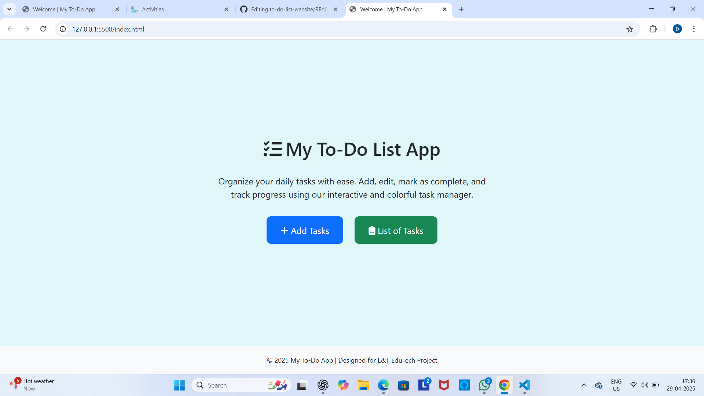
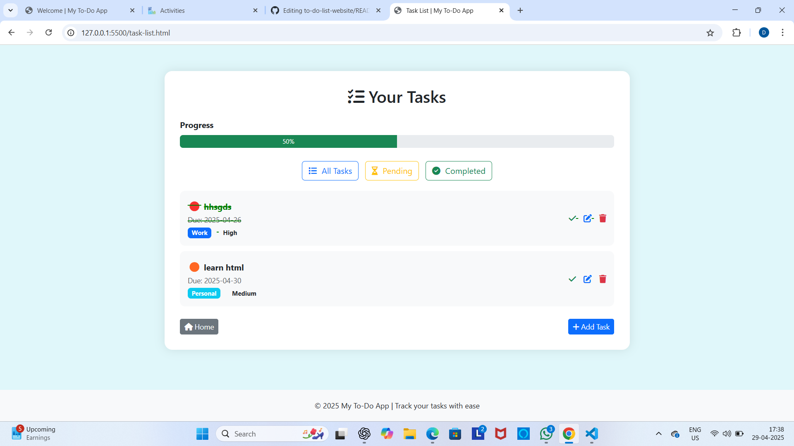

# to-do-list-website
# ✅ To-Do List Web Application

A modern and interactive web-based **To-Do List App** built using HTML, CSS, JavaScript, and Bootstrap as part of the **L&T EduTech Full Stack UI/UX Project**.

---

## 🌐 Domain:
**UI/UX Full Stack Development**

## 👥 Team Members:
- **Ramireddy Divya**
- **Nimmakayala Harsha Vardhan Reddy**
- **Pallam Balasubramanyam**
- **G.A. Chandu**

---

## 📝 Description:

Our project is a simple yet powerful **To-Do List Web Application** that allows users to:
- Add tasks with categories and priorities
- Track task completion with progress bar
- Filter tasks (All, Pending, Completed)
- Store tasks locally using **LocalStorage**
- Navigate between task adding and listing pages

We used the following tech stack:
- **HTML** – Structure of the app
- **CSS + Bootstrap** – Styling and responsiveness
- **JavaScript** – Task management logic
- **FontAwesome** – Icons

This was developed as a team under the **L&T EduTech initiative** and gave us hands-on experience with real-world full-stack web development.

---

## 📷 Screenshots

### 🏠 Landing Page


### ➕ Add Task Page


### 📋 Task List Page


---

## 🚀 How to Run

1. Download the repository or clone using:
   ```bash
   git clone https://github.com/DivyaRamireddy/to-do-list-website.git
